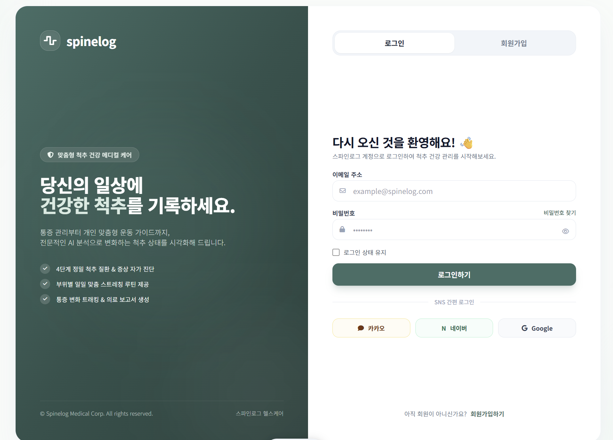

# UI 설계

## 형식과 틀 만들기

### 로그인, 회원가입 UI

### 2. 초기 상태 체크 UI

![스크린샷 2026-09-23 131403.png]img/%EC%8A%A4%ED%81%AC%EB%A6%B0%EC%83%B7_2026-09-23_131403.png)

다음주 예정

1. UI 보강 및 마무리하기
2. FRONTEND 설계, UI를 보고 직접 설계하기(틀 만들기)
3. 필요시 추가 DB 작성