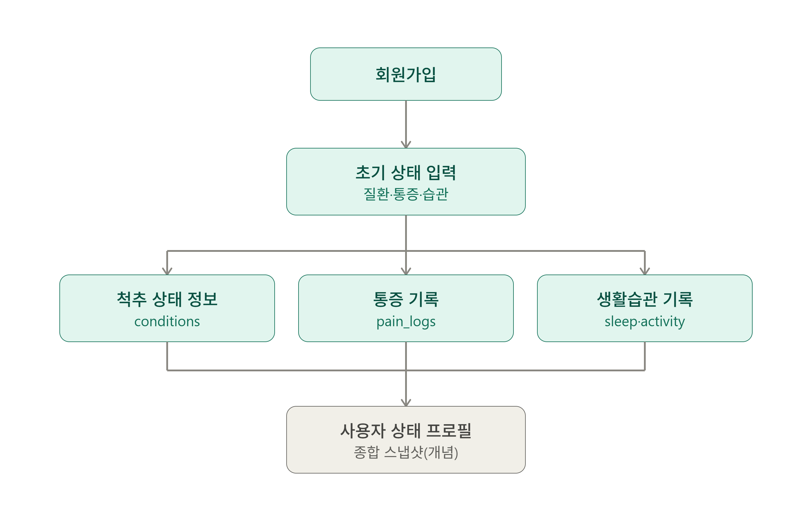
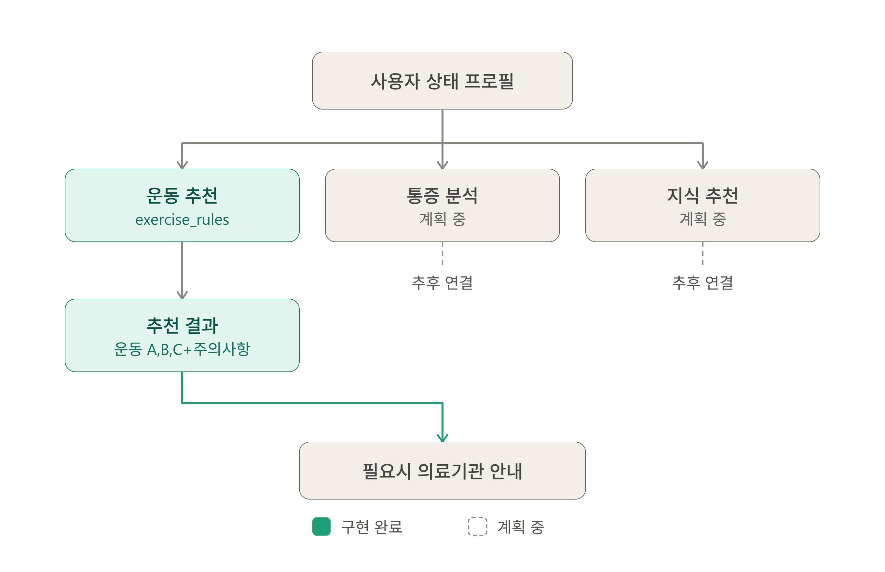
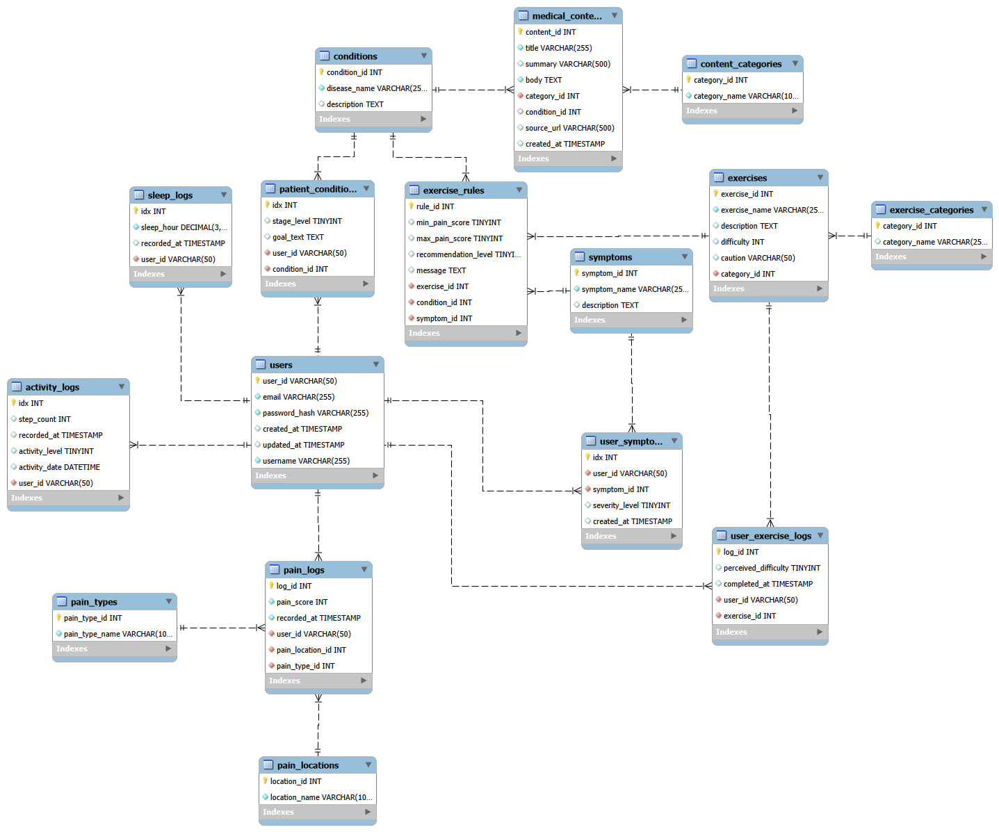

# S/W PROJECT  2 WEEKS

## 기능 흐름도

```markdown
												                회원
												                 │
												                 ▼
												          ┌─────────────┐
												         │ 초기 상태 입력 │
												          └──────┬──────┘
												                 │
												    ┌────────────┼────────────┐
												    ▼            ▼            ▼
												척추 상태       통증         생활습관
												진단정보        정보         운동정보
												    │            │            │
												    └────────────┼────────────┘
												                 ▼
											             사용자 상태 프로필
												                │
											  ┌─────────────────┼──────────────────┐
											  ▼                 ▼                  ▼
										  운동 추천         통증 분석          지식 추천
										      │                 │                  │
											  ▼         	  구상중          본인의 몸에
										  운동 A,B,C                         필요한 정보 제공
																				     
																│
																▼
														  필요시 의료기관
															 상담 권고
```





<aside>
⚠️

필요 정보

1. 통증 위치
2. 통증 정도
3. 통증 발생 시점
4. 통증 양상
5. 특정 움직임에서 악화되는지
6. 다리 저림 여부
7. 엉덩이/다리 통증 여부
8. 최근 운동
9. 오래 앉아 있었는지
10. 수면시간, 메트리스 강도
</aside>

## 프로젝트 기능

### 1. 사용자 관리

- 회원가입
- 로그인
- 개인정보
- 척추 상태
- 운동 목표

### 2. 척추 관리

- 질환/상태 등록
- 통증 기록
- 통증 변화 그래프
- 운동 기록
- 생활습관 기록

### 3. 추천/분석

- 운동 추천
- 통증 관련 요인 분석
- 추천 이유 설명
- 주의사항 제공

### 4. 의학 정보

- 척추 질환
- 척추 해부학
- 통증의 일반적인 원리
- 운동
- 생활습관
- 식단
- 시술
- 수술

### 5. 개인 대시보드

- 현재 상태
- 최근 통증
- 통증 추세
- 운동량
- 추천 운동
- 최근 본 의료정보

```markdown
 												           척추 질환
│
├── 1. 디스크 질환
│   ├── 추간판탈출증
│   ├── 추간판돌출
│   └── 퇴행성 디스크 질환
│
├── 2. 척추 불안정/정렬
│   ├── 척추분리증
│   └── 척추전방전위증
│       ├── Grade I
│       ├── Grade II
│       ├── Grade III
│       └── ...
│
├── 3. 척추관/신경 압박
│   ├── 척추관협착증
│   ├── 추간공협착증
│   └── 외측함요 협착
│
├── 4. 척추 변형
│   ├── 척추측만증
│   ├── 척추후만증
│   └── 척추전만 이상
│
├── 5. 골절/외상
│   └── 척추압박골절
│
├── 6. 염증성 질환
│   └── 강직성 척추염
│
└── 7. 감염/종양
├── 척추 감염
└── 척추 종양 
```

## DB 목록

**총 16개 테이블 구성 ( 추후 필요 테이블 추가 예정 )**

- **`users`**: 회원 기본 정보 및 인증 관리 (아이디, 해시된 비밀번호, 이메일 등)
- **`conditions`**: 척추 질환 종류 마스터 데이터 (디스크, 협착증, 전방전위증 등)
- **`patient_conditions`**: 사용자가 등록한 본인의 질환 상태 및 운동 목표
- **`symptoms`**: 증상 마스터 데이터 (저림, 찌릿함 등)
- **`user_symptoms`**: 사용자가 선택한 증상 및 심각도 기록
- **`pain_logs`**: 사용자의 일일 통증 기록 (통증 점수, 시점 등)
- **`pain_locations`**: 통증 발생 위치 마스터 (요부, 엉덩이, 다리 등)
- **`pain_types`**: 통증 양상/종류 마스터 (둔통, 찌르는 듯한 통증 등)
- **`sleep_logs`**: 수면 시간 및 수면 관련 일상 기록
- **`activity_logs`**: 걸음 수 및 활동량, 일상 활동 기록
- **`exercises`**: 추천/비추천 운동 상세 정보 및 난이도, 주의사항
- **`exercise_categories`**: 운동 분류 카테고리 (스트레칭, 코어 강화 등)
- **`exercise_rules`**: 통증 점수 및 질환/증상에 따른 맞춤 운동 추천 규칙 매핑
- **`user_exercise_logs`**: 사용자의 운동 수행 완료 기록 및 체감 난이도
- **`medical_contents`**: 의학 정보 및 척추 관련 큐레이션 콘텐츠 본문
- **`content_categories`**: 의학 정보 카테고리 (질환, 해부학, 시술/수술 등)

## DB 구성

**총 16개 테이블 구성**

#### 1. 회원 / 인증 (Users & Auth)

- **`users`**: 회원 기본 정보 및 인증 관리 (아이디, 해시된 비밀번호, 이메일, 닉네임 등)

#### 2. 상태 및 목표 (Status & Goals)

- **`conditions`**: 척추 질환 종류 마스터 데이터 (디스크, 협착증, 전방전위증 등)
- **`patient_conditions`**: 사용자가 등록한 본인의 질환 상태 및 운동 목표
- **`symptoms`**: 증상 마스터 데이터 (저림, 찌릿함 등)
- **`user_symptoms`**: 사용자가 선택한 증상 및 심각도 기록

#### 3. 기록 관리 (Log Management)

- **`pain_logs`**: 사용자의 일일 통증 기록 (통증 점수, 시점 등)
- **`pain_locations`**: 통증 발생 위치 마스터 (요부, 엉덩이, 다리 등)
- **`pain_types`**: 통증 양상/종류 마스터 (둔통, 찌르는 듯한 통증 등)
- **`sleep_logs`**: 수면 시간 및 수면 관련 일상 기록
- **`activity_logs`**: 걸음 수 및 활동량, 일상 활동 기록

#### 4. 추천 및 콘텐츠 (Recommendations & Contents)

- **`exercises`**: 추천/비추천 운동 상세 정보 및 난이도, 주의사항
- **`exercise_categories`**: 운동 분류 카테고리 (스트레칭, 코어 강화 등)
- **`exercise_rules`**: 통증 점수 및 질환/증상에 따른 맞춤 운동 추천 규칙 매핑
- **`medical_contents`**: 의학 정보 및 척추 관련 큐레이션 콘텐츠 본문
- **`content_categories`**: 의학 정보 카테고리 (질환, 해부학, 시술/수술 등)
- **`user_exercise_logs`**: 사용자의 운동 수행 완료 기록 및 체감 난이도

## 직접 값을 넣어야 하는 테이블

- **`conditions`**: 추천/비추천 운동 상세 정보 및 난이도, 주의사항 → O
- **`symptoms`**: 증상 마스터 데이터 (저림, 찌릿함 등) → O
- **`pain_locations`**: 통증 발생 위치 마스터 (요부, 엉덩이, 다리 등)
- **`pain_types`**: 통증 양상/종류 마스터 (둔통, 찌르는 듯한 통증 등)
- **`exercises`**: 추천/비추천 운동 상세 정보 및 난이도, 주의사항
- **`exercise_categories`**: 운동 분류 카테고리 (스트레칭, 코어 강화 등)
- **`exercise_rules`**: 통증 점수 및 질환/증상에 따른 맞춤 운동 추천 규칙 매핑
- **`medical_contents`**: 의학 정보 및 척추 관련 큐레이션 콘텐츠 본문
- **`content_categories`**: 의학 정보 카테고리 (질환, 해부학, 시술/수술 등)

## DB diagram



## 핵심 구현 API 목록

- **인증**: `POST /users` (회원가입 + 비밀번호 해시), `POST /login` (로그인 검증)
- **상태 관리**: `GET /symptoms`, `POST /user-symptoms` (증상 등록), `GET /users/{id}/onboarding-status`
- **통증 기록**: `POST /pain-logs`, `GET /pain-locations`, `GET /pain-types`, `GET /users/{id}/pain-logs`
- **의학 정보**: `GET /medical-contents`, `GET /medical-contents/{id}`
- **맞춤 추천**: `GET /users/{id}/exercise-recommendations` (통증 점수 및 질환/증상 기반 맞춤 운동 및 주의사항 산출)