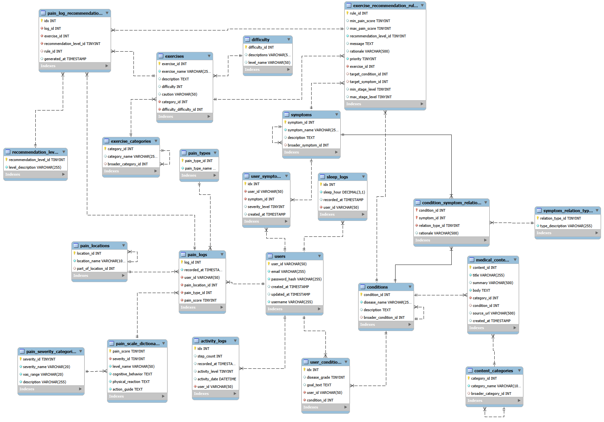

# 제목 없음

S/W Project 3 week

# 온톨로지(Ontology)

## 온톨로지의 본질

- **모델**: 특정 분야의 개념과 관계를 구조화한 **지식 표현 모델**입니다.
- **언어**: RDF, OWL 같은 형식 언어로 표현되어 컴퓨터가 이해할 수 있게 합니다.
- **도구**: 온톨로지를 작성·관리하는 소프트웨어(예: Protégé)가 존재하지만, 그것이 온톨로지 자체는 아닙니다.
- **AI와의 관계**: AI가 추론할 때 기반으로 삼는 ‘지식 구조’로 활용됩니다. 즉, AI가 똑똑해지려면 온톨로지가 필요합니다.
- **프로그램**: 실행되는 소프트웨어
- **AI**: 데이터를 학습해 추론·예측하는 시스템
- **온톨로지**: AI나 프로그램이 사용할 수 있는 **지식의 지도**

즉, 온톨로지는 **“지식의 설계도”**이고, 프로그램이나 AI는 그 설계도를 활용해 일을 합니다.

### 

계층 구조라고 다 같은 관계가 아닌 두 종류로 나뉨

| 관계 유형 | 의미 | 예시 |
| --- | --- | --- |
| **IS-A (하위분류/종류)** | "이건 저것의 한 종류다" | 디스크는 요추질환의 **한 종류**다 |
| **PART-OF (부분-전체)** | "이건 저것의 일부분이다" | 요추 상부는 허리의 **일부분**이다 |

지금 설계한 5개 테이블을 이 기준으로 나눠보면:

- `conditions`, `symptoms`, `content_categories`, `exercise_categories` → **IS-A 관계** (하위 분류)
- `pain_locations` → **PART-OF 관계** (신체 부위의 부분-전체)

**둘은 온톨로지에서 완전히 다른 관계 유형** (실제 OWL 온톨로지 언어에서도 `subClassOf`와 `partOf`를 구분해서 사용). 그런데 지금 둘 다 `parent_id`라는 같은 이름으로 표현하면, 나중에 "이 컬럼이 하위분류를 말하는 건지 부분을 말하는 건지" 이름만 보고 구분이 안 됨

### 대안: 관계 유형에 맞춰 이름 분리

**IS-A 관계 (conditions, symptoms, categories)** → `broader_*_id`

이건 임의로 지어낸 게 아니라, 실제 분류체계 표준인 **SKOS(Simple Knowledge Organization System)**에서 상위 개념을 가리킬 때 쓰는 공식 용어가 `broader`예요. "부모"보다 "더 넓은 개념"이라는 뜻이라 분류 체계엔 이 표현이 훨씬 자연스럽고, 발표 때 "SKOS 표준 관계 개념을 참고해 명명했다"고 하면 근거도 확실해짐

sql

```sql
broader_condition_id   -- (구 parent_condition_id)broader_symptom_id     -- (구 parent_symptom_id)broader_category_id    -- (구 parent_category_id, content/exercise 둘 다)
```

**PART-OF 관계 (pain_locations)** → `part_of_location_id`

sql

```sql
part_of_location_id    -- (구 parent_location_id)
```

### 정리

| 현재 | 개선안 | 이유 |
| --- | --- | --- |
| `parent_condition_id` | `broader_condition_id` | IS-A, SKOS 표준 용어 |
| `parent_symptom_id` | `broader_symptom_id` | IS-A, SKOS 표준 용어 |
| `parent_category_id` (x2) | `broader_category_id` | IS-A, SKOS 표준 용어 |
| `parent_location_id` | `part_of_location_id` | PART-OF, 다른 관계이므로 다른 이름 |

이렇게 이름을 나누면 "우리는 계층 구조를 만들 때도 관계의 종류(IS-A vs PART-OF)를 구분해서 설계했다"는 게 그 자체로 온톨로지 이해도를 보여주는 포인트가 돼요. 발표에서 이 구분을 한 문장만 언급해도 심사자 눈에 확 띌 겁니다.

관계형 데이터베이스(RDB) 설계 기법 중 **자기 참조(Self-Referencing)** 또는 **순환 관계(Recursive Relationship)** 패턴임.  

새로운 테이블을 분리하지 않고 동일 테이블 내에서 외래키(FK)를 참조하는 명확한 기술적 목적과 의미는 다음과 같음.

① 온톨로지(Ontology)의 개념과 도입 목적지식의 설계도: 온톨로지는 특정 분야의 개념과 관계를 구조화한 지식 표현 모델이며, AI나 프로그램이 추론을 수행할 수 있도록 돕는 ‘지식의 지도’ 역할을 담당함.
    - 자기 참조(Self-Referencing) 계층 구조: 다단계 트리 구조를 무한하게 확장하기 위해 동일 테이블 내에서 외래키를 참조하는 자기 참조 패턴을 도입함.
    - 관계 유형 분리 (IS-A vs PART-OF):IS-A (분류/종류): 
        - conditions, symptoms, 카테고리 테이블에 적용하며, 표준 분류 체계인 SKOS(Simple Knowledge Organization System) 표준을 차용하여 상위 개념을 가리키는 broader_*_id 네이밍을 적용함.
        - PART-OF (부분/전체): pain_locations (해부학적 포함 관계) 테이블에 적용하여 part_of_location_id로 명명함.

### **[1. N단계 계층(Tree) 구조의 무한 확장 지원]**

• 질환이나 부위를 대분류, 중분류, 소분류 등 별개의 테이블로 분리할 경우, 계층 깊이(Depth)가 늘어날 때마다 스키마(Schema)를 변경하여 테이블을 계속 추가해야 하는 구조적 한계가 발생함.

• 자기 자신을 참조하는 단일 테이블(`broader_condition_id`, `part_of_location_id`)을 사용하면, 구조 변경 없이 데이터 `INSERT`만으로 10단계든 100단계든 무한한 깊이의 부모-자식 트리 구조를 구축할 수 있음.  

### **[2. 온톨로지 지식망의 데이터 매핑]**

• `conditions` 테이블 (`broader_condition_id`): IS-A (분류) 계층. (예: '디스크 질환' ← '추간판탈출증' ← '요추 4-5번 추간판탈출증')  

• `pain_locations` 테이블 (`part_of_location_id`): PART-OF (해부학적 포함) 계층. (예: '하체'  ← '다리' ← '종아리')  

• 상위 개념(NULL 또는 최상위 ID)과 하위 개념 간의 관계를 단 하나의 테이블에서 완벽하게 표현하여 데이터베이스의 정규화 수준을 높임.

### **[3. 데이터베이스 성능 및 쿼리 효율성]**

• 계층을 파악하기 위해 여러 개의 테이블을 복잡하게 `JOIN`할 필요가 없음.

• SQL 표준 문법인 **재귀 CTE(Recursive Common Table Expression, `WITH RECURSIVE`)** 쿼리 한 번으로 특정 질환이나 부위의 전체 족보(하위 노드부터 최상위 부모 노드까지의 경로)를 단번에 추출함.

• 사용자가 "종아리 통증"을 입력했을 때, 시스템이 관계망을 타고 "종아리 → 다리 → 하체 방사통"으로 상위 개념을 역추적하여 척추 질환(예: 디스크)을 유추해 내는 추론 알고리즘의 핵심 기반이 됨.

현재 구현 중인 방식과 RAG(Retrieval-Augmented Generation, 검색 증강 생성)는 상호 보완적인 기술이나, 2주 단기 프로젝트 범위 내에서 LLM(대형 언어 모델)을 활용한 RAG 구현이 필수적인 것은 아님.

현재 구축 중인 시스템의 기술적 정체성과 RAG 적용 시의 아키텍처 차이는 다음과 같음.

### **[1. 현재 구현 중인 시스템: 규칙 기반 전문가 시스템 (Rule-based Expert System)]**

- **작동 원리:** RDB(MySQL)에 구축한 온톨로지 구조(질환-증상-운동 관계)를 SQL `JOIN`과 제어문(WHERE, 조건절)을 통해 탐색함.
- **출력 방식:** 매칭된 텍스트(`message`, `rationale`, `caution`)를 데이터베이스에서 그대로 꺼내어 프론트엔드에 전달함.
- **기술적 장점:** 결과가 100% 결정론적(Deterministic)임. 의료 도메인에서 가장 중요한 '정보의 정확성'과 '환각(Hallucination) 제로'를 완벽히 보장하며, 제한된 기간 내에 안정적인 API 서버(FastAPI)와 DB 연동을 완성하는 데 최적화된 아키텍처임.

### **[2. RAG 아키텍처 확장을 가정한 시스템 모델]**

- **작동 원리:** 사용자가 구축한 RDB 온톨로지를 지식 베이스(Knowledge Base)로 활용함. 사용자의 통증 입력이 들어오면 SQL 쿼리로 적합한 의학 정보와 추천 운동 데이터를 1차 추출(Retrieval)함.
- **출력 방식:** 추출된 데이터를 프롬프트 템플릿에 결합(Augmentation)하여 외부 LLM(예: OpenAI API, Gemini API)에 전송하면, LLM이 이를 바탕으로 자연스럽고 맥락에 맞는 문장을 생성(Generation)하여 환자에게 대화형으로 제공함.
- **적용 한계:** 백엔드 API 연동, 프롬프트 엔지니어링, LLM API 응답 지연(Latency) 처리 등 추가적인 엔지니어링 리소스가 요구됨.

### **[3. 프로젝트 전략 및 발표 권고사항]**

- **현재 집중 과제:** RAG 도입이나 LLM 연동에 리소스를 분산하기보다, 현재 설계된 16개 테이블 기반의 SQL 규칙 추론 엔진(Rule Engine)을 완벽히 작동시키고 React 프론트엔드에 연동하는 것에 집중할 것을 권고함.


## 기존 DB 목록

**총 16개 테이블 구성 ( 추후 필요 테이블 추가 예정 )**

- **`users`**: 회원 기본 정보 및 인증 관리 (아이디, 해시된 비밀번호, 이메일 등)
- **`conditions`**: 척추 질환 종류 마스터 데이터 (디스크, 협착증, 전방전위증 등)
- **`patient_conditions`**: 사용자가 등록한 본인의 질환 상태 및 운동 목표
- **`symptoms`**: 증상 마스터 데이터 (저림, 찌릿함 등)
- **`user_symptoms`**: 사용자가 선택한 증상 및 심각도 기록
- **`pain_logs`**: 사용자의 일일 통증 기록 (통증 점수, 시점 등)
- **`pain_locations`**: 통증 발생 위치 마스터 (요부, 엉덩이, 다리 등)
- **`pain_types`**: 통증 양상/종류 마스터 (둔통, 찌르는 듯한 통증 등)
- **`sleep_logs`**: 수면 시간 및 수면 관련 일상 기록
- **`activity_logs`**: 걸음 수 및 활동량, 일상 활동 기록
- **`exercises`**: 추천/비추천 운동 상세 정보 및 난이도, 주의사항
- **`exercise_categories`**: 운동 분류 카테고리 (스트레칭, 코어 강화 등)
- **`exercise_rules`**: 통증 점수 및 질환/증상에 따른 맞춤 운동 추천 규칙 매핑
- **`user_exercise_logs`**: 사용자의 운동 수행 완료 기록 및 체감 난이도
- **`medical_contents`**: 의학 정보 및 척추 관련 큐레이션 콘텐츠 본문
- **`content_categories`**: 의학 정보 카테고리 (질환, 해부학, 시술/수술 등)

## 신규 Diagram



## 신규 DB (22개)

- **users:** 회원 기본 정보 및 인증 관리 (아이디, 해시된 비밀번호, 이메일 등)
- **user_conditions:** (기존 `patient_conditions`에서 변경) 사용자가 등록한 본인의 질환 상태, 중증도 단계(`disease_grade`), 운동 목표 기록
- **conditions:** 척추 질환 종류 마스터 데이터 및 온톨로지 IS-A 계층 구조 (디스크, 협착증 등, `broader_condition_id`로 상하관계 정의)
- **symptoms:** 증상 마스터 데이터 및 온톨로지 IS-A 계층 구조 (저림, 찌릿함 등, `broader_symptom_id`로 상하관계 정의)
- **condition_symptom_relations:** (신규) 질환과 증상 간의 의학적 인과관계 및 근거(`rationale`) 매핑
- **symptom_relation_types:** (신규) 질환-증상 인과관계의 강도 및 종류 마스터 데이터 (흔함, 드묾 등)
- **user_symptoms:** 사용자가 초기 온보딩 시 선택한 증상 및 심각도 기록 (추론 엔진 폴백 기준값)
- **pain_logs:** 사용자의 일일 통증 기록 (통증 점수, 시점, 위치, 양상 등)
- **pain_locations:** 통증 발생 위치 마스터 및 온톨로지 PART-OF 계층 구조 (요부, 엉덩이, 다리 등, `part_of_location_id`로 포함관계 정의)
- **pain_types:** 통증 양상/종류 마스터 데이터 (둔통, 찌르는 듯한 통증 등)
- **sleep_logs:** 수면 시간 및 수면 관련 일상 기록
- **activity_logs:** 걸음 수 및 활동량, 일상 활동 기록
- **exercises:** 추천/비추천 운동 상세 정보 및 난이도, 주의사항
- **exercise_categories:** 운동 분류 카테고리 및 상하위 계층 구조 (`broader_category_id` 추가)
- **exercise_recommendation_rules:** (기존 `exercise_rules`에서 변경) 통증 점수 범위, 질환, 증상, 중증도에 따른 맞춤 운동 추천 복합 규칙 매핑
- **recommendation_levels:** (신규) 운동 추천 등급 마스터 데이터 (권장, 주의, 금기 등)
- **medical_contents:** 의학 정보 및 척추 관련 큐레이션 콘텐츠 본문 (출처 URL 포함)
- **content_categories:** 의학 정보 카테고리 및 상하위 계층 구조 (`broader_category_id` 추가)
- **pain_severity_categories**: (신규 추가) 통증의 심각도 범주, VAS(시각통증척도) 범위, 설명 등을 관리하는 마스터 테이블
- **pain_scale_dictionary:** (신규 추가) 통증 점수별 구체적인 인지·행동 반응 및 대처 가이드를 제공하는 사전 테이블
- **pain_log_recommendations**: (신규 추가) 사용자가 통증을 기록했을 때(`pain_logs`), 적용된 규칙(`rule_id`)과 추천 레벨에 따라 생성된 개인화 운동 추천 결과를 기록하는 매핑 테이블
- **difficulty**: (신규 추가) 운동 또는 질환·증상 등의 난이도 단계를 정의하는 공통 마스터 데이터 테이블

**1. 테이블 명칭 변경 및 정규화 (Refactoring)**

• **`patient_conditions` → `user_conditions` 변경**: `users`, `user_symptoms`와의 네이밍 일관성을 확보하여 사용자 상태를 관리하는 테이블임을 명확히 하였습니다.   
• **`exercise_rules` → `exercise_recommendation_rules` 변경**: 단순 규칙이 아닌 '추천'을 위한 룰 엔진 테이블임을 도메인 레벨에서 명시하였습니다.   

• **`recommendation_levels` 테이블 신설 분리**: 기존 룰 테이블 내부에 하드코딩되던 추천 등급(예: 권장, 주의, 금기)을 독립된 코드북(Codebook) 테이블로 제3정규화하여 데이터 무결성을 확보하였습니다.   
****

**2. 온톨로지 계층 구조(Hierarchy) 도입 (자기 참조 외래키 패턴)**
개념 간의 상하 관계를 표현하기 위해 강의 자료에서 다루는 **자기 참조 외래키(Self-Referencing FK)** 패턴을 주요 마스터 테이블에 일괄 도입하여, 무한한 깊이의 트리 구조 데이터를 단일 릴레이션으로 관리합니다.   

• **IS-A (분류 관계) 확장**:
    ◦ `conditions` → `broader_condition_id` 컬럼 추가 (예: 요추 질환 ← 디스크)   
    ◦ `symptoms` → `broader_symptom_id` 컬럼 추가 (예: 다리 통증 ← 종아리 저림)   
    ◦ `content_categories` → `broader_category_id` 컬럼 추가   
    ◦ `exercise_categories` → `broader_category_id` 컬럼 추가   

• **PART-OF (해부학적 포함 관계) 확장**:
    ◦ `pain_locations` → `part_of_location_id` 컬럼 추가 (예: 하체 ← 허벅지)   
****

**3. 인과관계(Causality) 추론 네트워크 신설**
질환(원인)과 증상(결과) 간의 의학적 연결 고리를 데이터베이스 단에서 독립적으로 연산하기 위해 M:N(다대다) 매핑 테이블 구조를 신설하였습니다.   

• **`condition_symptom_relations` 신설**: `condition_id`와 `symptom_id`를 복합 기본키(PK)로 사용하여 질환과 증상의 연결 관계를 정의하며, 의학적 근거를 남기기 위한 `rationale` 컬럼을 포함합니다.   

• **`symptom_relation_types` 신설**: 위 관계의 강도 및 종류(예: '흔한 증상', '드문 증상')를 정의하는 참조(Lookup) 테이블입니다.   
****

**4. 신규 EER 다이어그램 기준 핵심 컬럼 상세 명세
[사용자 및 프로필 도메인]**

• **`users`**: `user_id`(PK), `email`, `password_hash`, `username`, 생성/수정일시 (인증의 주체)   

• **`user_conditions`**: `idx`(PK), `disease_grade`(중증도 단계), `goal_text`(목표), `condition_id`(FK), `user_id`(FK)   

• **`user_symptoms`**: `idx`(PK), `severity_level`(심각도), `symptom_id`(FK), `user_id`(FK)   
****

**[지식 베이스(온톨로지) 및 콘텐츠 도메인]**

• **`conditions`**: `condition_id`(PK), `disease_name`, `description`, `broader_condition_id`(부모 질환, 자기 참조 FK)   

• **`symptoms`**: `symptom_id`(PK), `symptom_name`, `description`, `broader_symptom_id`(부모 증상, 자기 참조 FK)   

• **`condition_symptom_relations`**: `condition_id`(FK), `symptom_id`(FK), `relation_type_id`(FK), `rationale` (복합 PK 및 외래키 제약조건 적용)   

• **`symptom_relation_types`**: `relation_type_id`(PK), `type_description` (인과관계 종류 마스터)   

• **`medical_contents`**: `content_id`(PK), `title`, `summary`, `body`, `source_url`(출처 링크), `condition_id`(FK), `category_id`(FK)   

• **`content_categories`**: `category_id`(PK), `category_name`, `broader_category_id`(부모 카테고리)   
****

**[기록(Logging) 및 라이프로그 도메인]**

• **`pain_logs`**: `log_id`(PK), `pain_score`(1~10 점수), `recorded_at`, `pain_location_id`(FK), `pain_type_id`(FK), `user_id`(FK) (일일 통증 트래킹)   

• **`pain_locations`**: `location_id`(PK), `location_name`, `part_of_location_id`(상위 포함 위치, 자기 참조 FK)   

• **`pain_types`**: `pain_type_id`(PK), `pain_type_name` (통증 양상 마스터)   

• **`pain_severity_categories`**: `severity_id`(PK), `severity_name`, `vas_range`, `description` (통증 심각도 범주)   

• **`pain_scale_dictionary`**: `pain_score`(PK), `severity_id`(FK), `level_name`, `cognitive_behavior`, `physical_reaction`, `action_guide` (통증 점수별 가이드 사전)   

• **`activity_logs`**: `idx`(PK), `step_count`, `activity_level`, `activity_date`, `user_id`(FK) (활동량 시계열 추적)   

• **`sleep_logs`**: `idx`(PK), `sleep_hour`, `recorded_at`, `user_id`(FK) (수면 시간 시계열 추적)   
****

**[추천 엔진(Rule Engine) 도메인]**

• **`exercises`**: `exercise_id`(PK), `exercise_name`, `difficulty`(난이도), `caution`(주의사항), `category_id`(FK)   

• **`exercise_categories`**: `category_id`(PK), `category_name`, `broader_category_id`(부모 운동 카테고리)   

• **`exercise_recommendation_rules`**: `rule_id`(PK), `min_pain_score` / `max_pain_score`(통증 점수 범위), `min_stage_level` / `max_stage_level`(질환 단계 범위), `target_condition_id`(FK), `target_symptom_id`(FK), `recommendation_level_id`(FK), `priority`(우선순위)   

• **`recommendation_levels`**: `recommendation_level_id`(PK), `level_description` (운동 추천 등급 마스터)   

• **`pain_log_recommendations`**: `idx`(PK), `log_id`(FK), `exercise_id`(FK), `recommendation_level_id`(FK), `rule_id`(FK), `generated_at` (통증 기록 시점 추천 결과 매핑)   

• **`difficulty`**: `difficulty_id`(PK), `descriptions`, `level_name` (난이도 공통 마스터) 

## DB에 더미 데이터 넣기

### 직접 값 입력해야 하는 테이블

- **conditions:** 척추 질환 종류 마스터 데이터 및 온톨로지 IS-A 계층 구조 (디스크, 협착증 등, `broader_condition_id`로 상하관계 정의)
- **symptoms:** 증상 마스터 데이터 및 온톨로지 IS-A 계층 구조 (저림, 찌릿함 등, `broader_symptom_id`로 상하관계 정의)
- **condition_symptom_relations:** (신규) 질환과 증상 간의 의학적 인과관계 및 근거(`rationale`) 매핑
- **symptom_relation_types:** (신규) 질환-증상 인과관계의 강도 및 종류 마스터 데이터 (흔함, 드묾 등)
- **pain_logs:** 사용자의 일일 통증 기록 (통증 점수, 시점, 위치, 양상 등)
- **pain_locations:** 통증 발생 위치 마스터 및 온톨로지 PART-OF 계층 구조 (요부, 엉덩이, 다리 등, `part_of_location_id`로 포함관계 정의)
- **pain_types:** 통증 양상/종류 마스터 데이터 (둔통, 찌르는 듯한 통증 등)
- **exercises:** 추천/비추천 운동 상세 정보 및 난이도, 주의사항
- **exercise_categories:** 운동 분류 카테고리 및 상하위 계층 구조 (`broader_category_id` 추가)
- **exercise_recommendation_rules:** (기존 `exercise_rules`에서 변경) 통증 점수 범위, 질환, 증상, 중증도에 따른 맞춤 운동 추천 복합 규칙 매핑
- **recommendation_levels:** (신규) 운동 추천 등급 마스터 데이터 (권장, 주의, 금기 등)
- **medical_contents:** 의학 정보 및 척추 관련 큐레이션 콘텐츠 본문 (출처 URL 포함)
- **content_categories:** 의학 정보 카테고리 및 상하위 계층 구조 (`broader_category_id` 추가)

### 사용자가 입력하는 테이블

- **users:** 회원 기본 정보 및 인증 관리 (아이디, 해시된 비밀번호, 이메일 등)
- **user_conditions:** (기존 `patient_conditions`에서 변경) 사용자가 등록한 본인의 질환 상태, 중증도 단계(`disease_grade`), 운동 목표 기록
- **user_symptoms:** 사용자가 초기 온보딩 시 선택한 증상 및 심각도 기록 (추론 엔진 폴백 기준값)
- **sleep_logs:** 수면 시간 및 수면 관련 일상 기록
- **activity_logs:** 걸음 수 및 활동량, 일상 활동 기록
- **user_exercise_logs:** 사용자의 운동 수행 완료 기록 및 체감 난이도 (기존 유지)

## PQRST

환자의 통증 상태를 체계적으로 확인하기 위한 핵심 평가 도구인 **통증사정** PQRST는 5가지 질문 항목의 앞글자를 딴 것. [[1](https://m.blog.naver.com/heaven0427/220943609159), [2](https://mymerci.kr/pages/nclex_q.php?qn_id=271295)]**PQRST 항목별 내용**

**P (Provocation / Palliation — 유발 및 완화 요인)**
    ◦ 통증이 생기게 된 이유나 악화시키는 원인을 찾습니다.
    ◦ 통증이 줄어드는 방법이나 자세가 있는지 확인합니다. 

**Q (Quality — 통증의 양상)**
    ◦ 통증의 느낌을 자세히 묻습니다.
    ◦ 쑤시는지, 찌르는지, 화끈거리는지 환자의 표현을 듣습니다. 

**R (Region / Radiation — 부위와 방사)**
    ◦ 아픈 위치를 정확히 확인합니다.
    ◦ 통증이 다른 부위로 퍼져 나가는지 살펴봅니다. 

**S (Severity — 통증 강도)**
    ◦ 통증의 심한 정도를 측정합니다.
    ◦ 주로 0부터 10까지의 숫자(NRS)로 점수를 매겨 표현하게 합니다. 

**T (Timing — 시간적 양상)**
    ◦ 통증이 언제 시작되었는지 파악합니다.
    ◦ 얼마나 오래 지속되는지, 얼마나 자주 나타나는지 확인합니다. [[1](https://m.blog.naver.com/heaven0427/220943609159), [2](https://nurse-link.co.kr/community/nurse_talk/117199604), [3](https://nurse-link.co.kr/community/campus_talk/120972783)]

## **NRS(Numeric Rating Scale)와 VAS(Visual Analogue Scale)의 개념 및 차이점**

### **1. NRS (숫자통증척도, Numeric Rating Scale)**

- **평가 방식:** 통증이 없는 상태를 0, 상상할 수 있는 최악의 통증을 10(또는 100)으로 설정하여, 환자 본인이 느끼는 통증 강도를 숫자로 직접 선택하게 하는 방식. (현재 구축 중인 데이터베이스의 0~10 통증 점수 기준이 전형적인 NRS 방식에 해당함.)
- **장점:** 종이나 도구 없이 구두 문진만으로도 빠르고 간편하게 측정 가능. 이해하기 쉬워 임상 현장 및 자가 진단 시 순응도가 매우 높음.
- **특징:** 돌발성 통증이나 시간대별 통증 변화를 추적할 때 측정의 재현성(Reproducibility)이 뛰어남.

### **2. VAS (시각아날로그척도, Visual Analogue Scale)**

- **평가 방식:** 10cm(100mm) 길이의 직선 위에 왼쪽 끝을 '통증 없음', 오른쪽 끝을 '상상할 수 있는 최악의 통증'으로 두고, 환자가 현재 느끼는 통증의 강도를 선 위에 직접 펜으로 표시하게 하는 방식. 의료진이 자를 이용해 표시된 위치까지의 거리를 밀리미터(mm) 단위로 재어 점수화함.
- **장점:** 환자가 특정 숫자의 틀에 얽매이지 않고 연속적인 선분 위에 미세한 통증의 정도를 표현할 수 있어, 통증의 미묘한 증감 변화를 연속선상에서 민감하게 반영함.
- **단점:** 시각적 도구(종이 척도)와 측정용 자가 반드시 필요함. 시력이 저하되거나 손의 미세 운동 조절이 둔화된 고령 및 중증 환자의 경우 측정 실패율이 NRS에 비해 높음.

### **3. 의학 논문 및 임상 가이드라인 기반 비교 요약**

- **상호 연관성:** 미국 국립보건원(NIH) StatPearls 및 정형외과·신경외과 통증 평가 논문(PubMed)에 따르면, 두 척도 모두 통증 강도를 평가하는 객관화 도구로서 높은 상관관계를 가짐.
- **측정의 차이:** 완전히 대체 가능한 평행 척도(Parallel scales)는 아니며, 시각적 기호화(VAS)와 숫자적 기호화(NRS)라는 방식 차이로 인해 환자의 통증 인지를 다소 다른 측면에서 반영한다는 연구 결과가 존재함.
- **실무적 선호도:** 과거 임상 연구에서는 미세한 수치 분할이 가능한 VAS가 많이 쓰였으나, 최근 임상 및 디지털 헬스케어(데이터베이스 구축 등) 영역에서는 측정의 직관성, 높은 환자 순응도, 입력의 편의성 덕분에 NRS-11(0~10점 척도) 사용이 표준처럼 더 선호되는 추세임.

### **NRS와 VAS 간의 실제 점수 차이**

임상 연구 결과에 따르면, **NRS 점수가 VAS 점수보다 약간 더 높게 측정되는 경향**이 있습니다.

- **평균 점수 차이**: 요통 환자를 대상으로 한 연구에서 NRS 평균값(7.41점)이 VAS 평균값(6.86점)보다 **약 0.54점 높게** 나타났으며, 수평선 VAS(4.32점)와 NRS(4.57점)를 비교한 연구에서도 NRS가 **0.25점 높게** 측정되었습니다

### 처음 구현은 NRS로 구현

## 추후 구현할 테이블

- **medical_contents:** 의학 정보 및 척추 관련 큐레이션 콘텐츠 본문 (출처 URL 포함)
- **content_categories:** 의학 정보 카테고리 및 상하위 계층 구조 (`broader_category_id` 추가)
- **pain_log_recommendations**: (신규 추가) 사용자가 통증을 기록했을 때(`pain_logs`), 적용된 규칙(`rule_id`)과 추천 레벨에 따라 생성된 개인화 운동 추천 결과를 기록하는 매핑 테이블

## 추후 채울 테이블

- **user_conditions:** (기존 `patient_conditions`에서 변경) 사용자가 등록한 본인의 질환 상태, 중증도 단계(`disease_grade`), 운동 목표 기록
- **user_symptoms:** 사용자가 초기 온보딩 시 선택한 증상 및 심각도 기록 (추론 엔진 폴백 기준값)
- **pain_logs:** 사용자의 일일 통증 기록 (통증 점수, 시점, 위치, 양상 등)
- **sleep_logs:** 수면 시간 및 수면 관련 일상 기록
- **activity_logs :** 활동 기록

### 1. 허리디스크 (Lumbar Disc Herniation with Radiculopathy)

- 정의: 추간판 정상 경계를 벗어난 디스크 물질의 국소 변위로 통증·근력저하·감각저하 유발 (NASS 2014)
- 다리저림(방사통): COMMON — 근위축/피부분절 분포를 따른 방사통이 정의적 특징
- 허리통증: COMMON
- 감각이상: OCCASIONAL — 신경근 압박 시 동반
- 근력약화: OCCASIONAL — 운동신경 침범 시 발생
- 앉을 때 악화: OCCASIONAL — 고전적으로 좌위 시 추간판 내압 증가 보고, but 최근 메타분석은 퇴행성 디스크에서 유의차 없음 (Li et al., 2022) → 근거 엇갈림

### 2. 척추관협착증 (Lumbar Spinal Stenosis with Neurogenic Claudication)

- 정의: 보행/기립 시 악화, 굴곡·좌위 시 완화되는 신경성 파행 (AAPM&R)
- 신경성 파행: COMMON — 협착증의 고전적 정의 그 자체
- 다리저림: COMMON — 신경근 압박으로 인한 하지 저림
- 감각이상: OCCASIONAL
- 근력약화: RARE — 중증 진행 시에만

### 3. 척추전방전위증 (Spondylolisthesis)

- 참고: Meyerding 등급 ↑ = 증상 중증도 ↑ 경향 (Orthopedic Reviews)
- 허리통증: COMMON — 구조적 불안정성 및 인접조직 스트레스
- 다리저림: OCCASIONAL — 고등급일수록 신경근 압박 동반 ↑
- 근력약화: OCCASIONAL — 신경근 압박 동반 시

### 4. 척추측만증 (Adolescent Idiopathic Scoliosis)

- 참고: 뚜렷한 요통은 드묾 → 있으면 감염/염증/종양 등 타 진단 의심 필요 (AAFP 2020)
- 허리통증: OCCASIONAL — 대조군 대비 빈도/기간 ↑ 보고 있으나 만곡 자체가 직접 원인인지는 불명확
- 근력약화: RARE — 중증 만곡에서만
- 감각이상: RARE — 중증 만곡에서만

### 5. 척추분리증 (Spondylolysis)

- 허리통증: COMMON — 협부(pars interarticularis) 피로골절로 인한 가장 흔한 증상
- 다리저림: RARE — 신경학적 결손은 진행된 병변에서만 드물게 동반

### 6. 강직성 척추염 (Ankylosing Spondylitis)

- 참고: ASAS 염증성 요통(IBP) 기준 — 45세 이전 발병 / 서서히 시작 / 운동시 호전·휴식시 악화 / 야간통증 / 조조강직 30분 이상, 이 중 다수 충족
- 아침 통증 및 강직: COMMON — ASAS 기준 핵심 항목
- 뻣뻣함: COMMON — 척추 가동성 저하, ASAS 핵심 평가 영역
- 허리통증: COMMON — 운동 호전/휴식 악화라는 염증성 패턴이 기계적 요통과 구분점

### 7. 요추 염좌 (Acute Lumbar Strain/Sprain)

- 허리통증: COMMON — 근육/인대 손상 부위의 국소 통증, 다리까지는 뻗치지 않음이 특징 (AANS)
- 뻣뻣함: COMMON — 방어성 근경직으로 인한 가동범위 제한

---